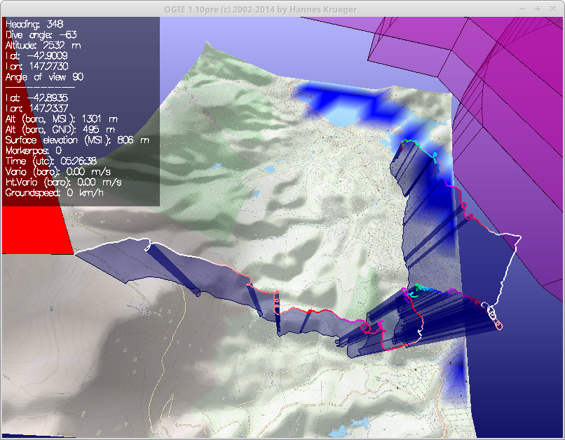

#OSM Tiles Download

Creates a full size jpg map from tiles available from openstreet map. The openstreetmap tiles are downloaded using all different tile servers available(known),
and doing it asynchronously to make the download of tiles as fast as possible. The different tiles are then merged into a full sized map in jpg format to be use in your GPS or computer

The following map tile style are allowed : sat landscape outdoors transport cycle

## Use with OGIE3D flight data analyser for paragliding

The ```osm_ogie3d.py``` is to be used in conjonctio with OGIE3D and GPLIGC software for paragliding. This script reads the LAT LON boundaries (an offset of 0.027 degrees is added) of an IGC file and downloads tiles from openstreetmap
using all different tile servers available, and doing it asynchronously to make it really fast
The tiles are then merged into one jpg. The file is moved to the .gpligc/map folder if exists and the various information
needed (map file path, corner coordinates) are added to the .ogierc config file for OGIE3D software.

### Examples:
```
 ./osm_ogie3d.py [map_name] [igc_file] [zoom_level] [map_tile_style]
 ./osm_ogie3d.py mount_wellington example/2016-02-02-FLY-5348-01.IGC 15 outdoors | xargs display
 ./osm_ogie3d.py testmap igcFile.igc 11 sat
```



### OGIE3D, GPLIGC paragliding software - install tips
install http://pc12-c714.uibk.ac.at/GPLIGC/GPLIGC.html if want to use with OGIE3D
Also compiled from source by myself at https://github.com/lbesnard/chef_laptop/blob/master/dpkg/gpligc_1.10pre7-1_amd64.deb
and make sure to install the different debian packages {freeglut3 freeglut3-dev gnuplot perl-tk xterm gnuplot-x11 kflog}


## Generic Use
The ```osm_download.py``` script creates a full size jpg map only. No other fancy thing.

### Examples:
```
./osm_download.py [map_name] [latitude_center] [longitude_center] [zoom_level] [distance_in_kms_from_lat_lon_center] [map_tile_style] [output_dir]
./osm_download.py hobart -42.85 147.194824219 14 10 cycle `mktemp -d` | xargs display
./osm_download.py hobart -42.85 147.194824219 11 30 sat `mktemp -d`
```

## Requirements
pip install grequests
imagemagick
... Linux . Have no idea if this would work on OSX

